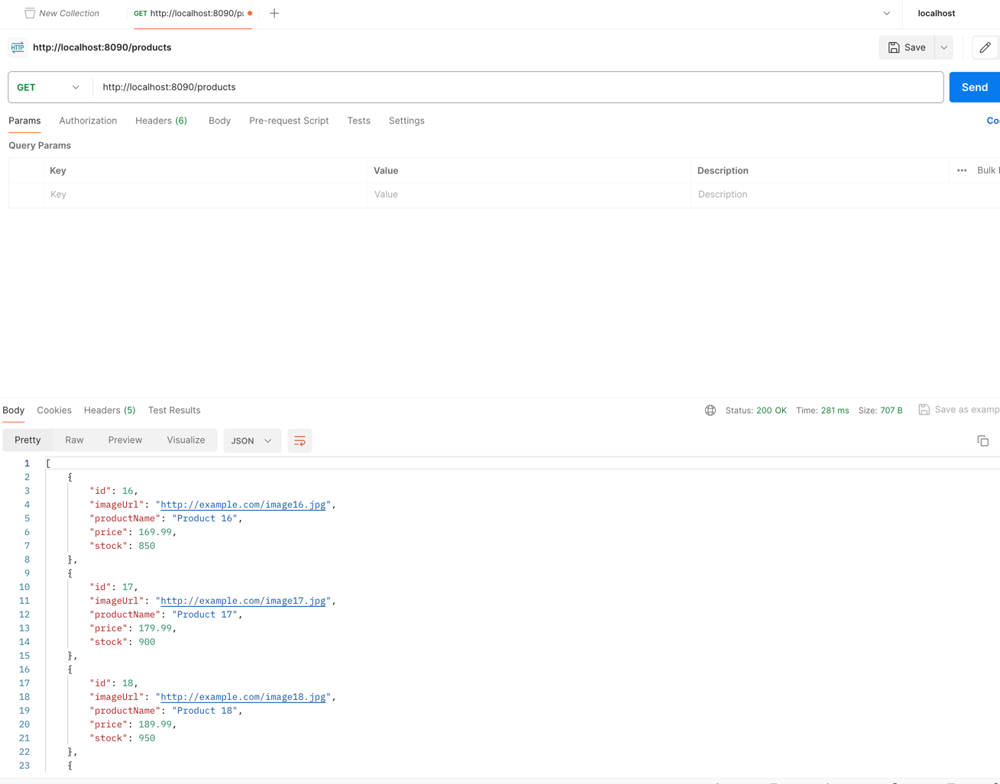

# 遇到的问题
- 使用intelliJ Build 菜单没有打包成功
  - 解决：使用命令行打包成功
- 如何让web app访问到docker中的mysql
  - 解决：
    - 创建网络，并使用`--net networkmysql`参数，将web app和mysql连接到同一个网络中
    - 将app 打成 image 在 docker 中运行（应该可以从本地直接连到 docker mysql，todo）

# Commands used

## 创建 mysql 以及 对应的网络

```bash

docker run -d --name mysql-server -e MYSQL_ROOT_PASSWORD=root -e MYSQL_DATABASE=shopping_db -p 3306:3306 mysql:latest

docker network create networkmysql

docker network connect networkmysql mysql-server
```

### 数据库中准备数据

```bash
docker exec -it 6eca6c8bdb90 mysql -u root -p
```

```mysql-sql
show database;
use shopping_db;
show tables;
desc product;
SELECT * FROM product;
```

```mysql-sql
INSERT INTO product (image_url, price, product_name, stock) VALUES
    -> ('http://example.com/image1.jpg', 19.99, 'Product 1', 100),
    -> ('http://example.com/image2.jpg', 29.99, 'Product 2', 150),
    -> ('http://example.com/image3.jpg', 39.99, 'Product 3', 200),
    -> ('http://example.com/image4.jpg', 49.99, 'Product 4', 250),
    -> ('http://example.com/image5.jpg', 59.99, 'Product 5', 300),
    -> ('http://example.com/image6.jpg', 69.99, 'Product 6', 350),
    -> ('http://example.com/image7.jpg', 79.99, 'Product 7', 400),
    -> ('http://example.com/image8.jpg', 89.99, 'Product 8', 450),
    -> ('http://example.com/image9.jpg', 99.99, 'Product 9', 500),
    -> ('http://example.com/image10.jpg', 109.99, 'Product 10', 550),
    -> ('http://example.com/image11.jpg', 119.99, 'Product 11', 600),
    -> ('http://example.com/image12.jpg', 129.99, 'Product 12', 650),
    -> ('http://example.com/image13.jpg', 139.99, 'Product 13', 700),
    -> ('http://example.com/image14.jpg', 149.99, 'Product 14', 750),
    -> ('http://example.com/image15.jpg', 159.99, 'Product 15', 800),
    -> ('http://example.com/image16.jpg', 169.99, 'Product 16', 850),
    -> ('http://example.com/image17.jpg', 179.99, 'Product 17', 900),
    -> ('http://example.com/image18.jpg', 189.99, 'Product 18', 950),
    -> ('http://example.com/image19.jpg', 199.99, 'Product 19', 1000),
    -> ('http://example.com/image20.jpg', 209.99, 'Product 20', 1050);
```

## 打包 web app
为了打包，需要在build.gradle中添加：
```groovy
jar {
    manifest {
        attributes 'Main-Class': 'org.example.ShoppingApplication'
    }
}
```

本地项目目录用 gradle 打包：

```bash
./gradlew clean
./gradlew build
```

## 给 web app build  image 
`docker build -t  shoppingimage .`

## 运行 web app
`docker run -p 8090:8080 --name crudcontainer --net networkmysql -e MYSQL_HOST=mysql-server -e MYSQL_ROOT_PASSWORD=root -e MYSQL_DATABASE=shopping_db shoppingimage`